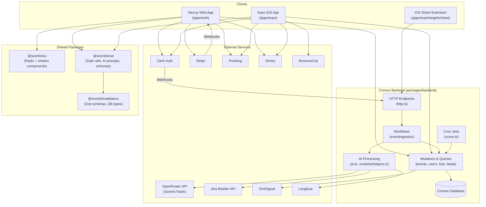
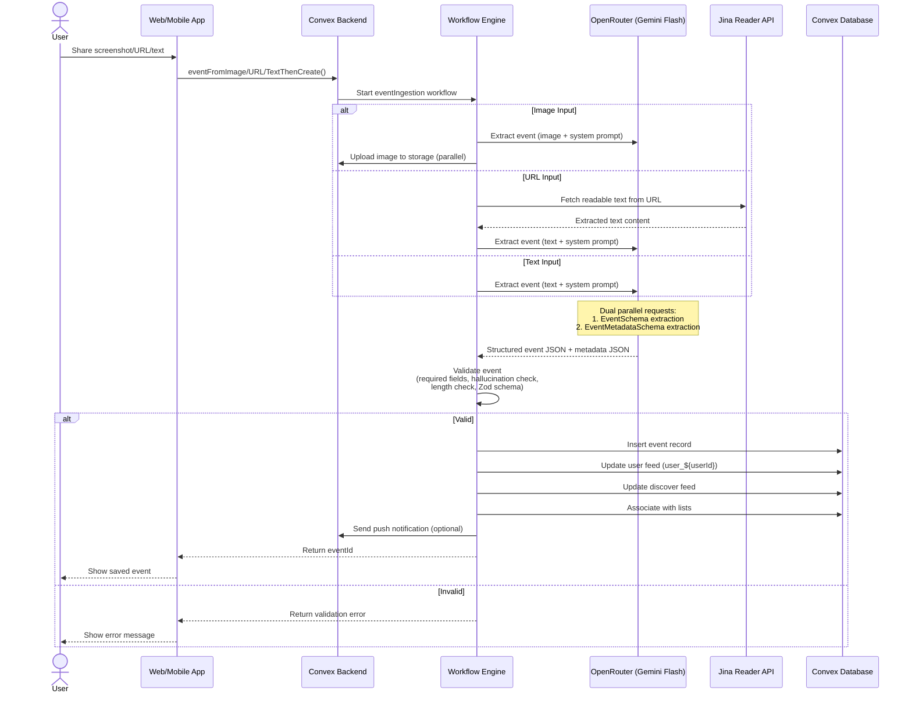
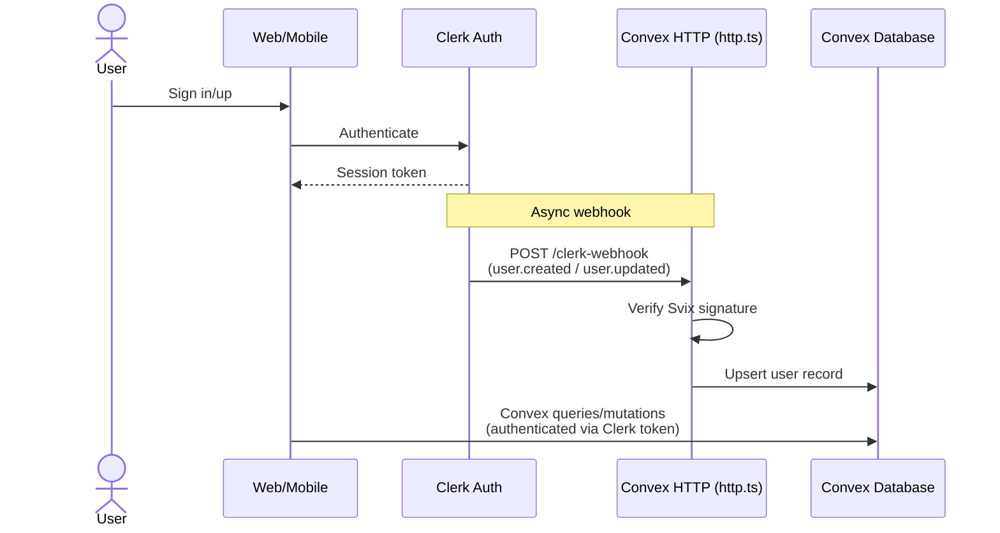
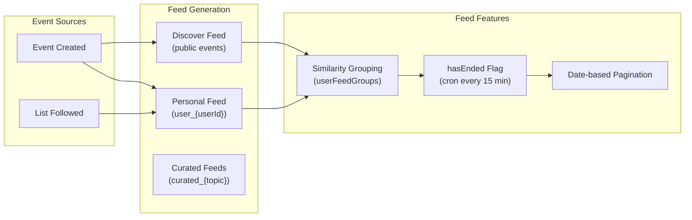

# Codebase Overview: Soonlist

> **"Turn screenshots into plans."**
> Soonlist is a cross-platform app (iOS + Web) that lets users save events by parsing them with AI. Users can share screenshots or text, and the system extracts structured calendar events, organizes them into feeds and lists, and enables social discovery.

---

## 1. Tech Stack & Tools

| Layer | Technology |
|-------|-----------|
| **Monorepo** | Turborepo + pnpm 9.15.9 workspaces |
| **Language** | TypeScript 5.9.2 (strict, throughout) |
| **Web App** | Next.js 15.1.9, React 19.2.0, App Router |
| **Mobile App** | Expo 55.0.0-preview.12, React Native 0.83.2, Expo Router |
| **Backend** | Convex 1.31.2 (serverless: queries, mutations, actions, crons, HTTP) |
| **Auth** | Clerk (web: `@clerk/nextjs`, mobile: `@clerk/clerk-expo`) |
| **Database** | Convex (document DB with indexes and real-time subscriptions) |
| **AI / LLM** | OpenRouter API via Vercel AI SDK (`@ai-sdk/openai`), primary model: `google/gemini-2.5-flash:nitro` |
| **AI Observability** | Langfuse 3.11.0 |
| **Styling (Web)** | TailwindCSS 3.4.3 + Radix UI + shadcn/ui pattern |
| **Styling (Mobile)** | NativeWind 4.2.1 (Tailwind for RN) |
| **State (Mobile)** | Zustand 4.5.5 |
| **Server State** | TanStack React Query 5.74.7 (both platforms) |
| **Payments** | Stripe (web), RevenueCat (mobile in-app purchases) |
| **Notifications** | OneSignal (push), Expo Notifications |
| **Analytics** | PostHog (both platforms), Sentry (error tracking) |
| **File Upload** | Bytescale SDK |
| **Customer Support** | Intercom (both platforms) |
| **CI/CD** | GitHub Actions, EAS Build (Expo) |
| **Linting** | ESLint 9, Prettier 3.2.5 (import sorting + Tailwind class sorting) |
| **E2E Testing** | Playwright (web), Maestro (mobile) |

---

## 2. High-Level Architecture



---

## 3. Folder Structure Summary

```
soonlist-turbo/
├── apps/
│   ├── web/                          # Next.js 15 web application
│   │   ├── app/                      # App Router pages
│   │   │   ├── (base)/               # Main layout group
│   │   │   │   ├── [userName]/       # User profiles & lists
│   │   │   │   ├── event/            # Event detail pages
│   │   │   │   ├── explore/          # Public event discovery
│   │   │   │   ├── account/          # Account management
│   │   │   │   └── ...              # about, contact, get-started, join, sign-in/up
│   │   │   ├── (marketing)/          # Marketing pages (privacy, terms)
│   │   │   ├── (minimal)/new/        # Event creation (minimal chrome)
│   │   │   └── api/                  # API routes
│   │   │       ├── webhooks/         # Clerk & Stripe webhooks
│   │   │       ├── og/               # Open Graph image generation
│   │   │       └── image-proxy/      # Image proxy
│   │   ├── components/               # Web-specific components
│   │   ├── context/                  # React context providers
│   │   ├── hooks/                    # Custom hooks
│   │   ├── lib/                      # Utilities (Convex client, Intercom)
│   │   ├── styles/                   # Global CSS
│   │   └── env.ts                    # T3 env validation (Zod)
│   │
│   └── expo/                         # Expo/React Native iOS app
│       ├── src/
│       │   ├── app/                  # Expo Router (file-based)
│       │   │   ├── (auth)/           # Auth screens
│       │   │   ├── (onboarding)/     # Onboarding flow
│       │   │   ├── (tabs)/           # Main tab navigation (feed, search, profile)
│       │   │   ├── event/            # Event details
│       │   │   └── settings/         # Settings
│       │   ├── components/           # RN components (auth, UI, icons)
│       │   ├── hooks/                # Custom hooks
│       │   ├── store/                # Zustand stores
│       │   ├── providers/            # Context providers
│       │   └── lib/                  # Utilities
│       ├── targets/share/            # iOS Share Extension
│       └── .maestro/                 # E2E test flows
│
├── packages/
│   ├── backend/                      # Convex serverless backend
│   │   └── convex/
│   │       ├── schema.ts             # Database schema
│   │       ├── ai.ts                 # AI entry points
│   │       ├── events.ts             # Event CRUD
│   │       ├── users.ts              # User management
│   │       ├── lists.ts              # List operations
│   │       ├── feeds.ts              # Feed generation
│   │       ├── http.ts               # HTTP endpoints
│   │       ├── crons.ts              # Scheduled jobs
│   │       ├── notifications.ts      # Push notifications
│   │       ├── model/                # Business logic helpers
│   │       │   ├── ai.ts             # AI validation
│   │       │   ├── aiHelpers.ts      # AI API calls, prompts
│   │       │   ├── events.ts         # Event insertion logic
│   │       │   └── ...
│   │       └── workflows/
│   │           └── eventIngestion.ts # Multi-step event creation
│   │
│   ├── ui/                           # Shared UI components (web-only)
│   │   └── src/                      # shadcn/ui + Radix components
│   │
│   ├── cal/                          # Calendar utilities
│   │   └── src/
│   │       ├── utils.ts              # Date/time parsing (Temporal API)
│   │       ├── prompts.ts            # AI extraction schemas & prompts
│   │       └── similarEvents.ts      # Cosine similarity grouping
│   │
│   └── validators/                   # Shared Zod schemas & types
│       └── src/
│           ├── index.ts              # Validation schemas
│           └── db.ts                 # Database entity interfaces
│
└── tooling/
    ├── eslint/                       # Shared ESLint configs (base, nextjs, react)
    ├── prettier/                     # Prettier config (import sort + Tailwind)
    ├── tailwind/                     # Tailwind presets (web + native)
    └── typescript/                   # Shared tsconfig bases
```

---

## 4. Key Modules & Responsibilities

### Apps

| Module | Responsibility |
|--------|---------------|
| **`apps/web`** | Next.js web application. Server-rendered pages, API route handlers for Stripe/Clerk webhooks, OG image generation. Uses App Router with route groups for layout isolation. |
| **`apps/expo`** | Expo iOS app with Expo Router. Tab-based navigation (feed, search, profile). Includes iOS Share Extension for capturing events from any app. Zustand for local state. |

### Shared Packages

| Package | Responsibility |
|---------|---------------|
| **`@soonlist/backend`** | All server-side logic via Convex. Database schema, AI event extraction, CRUD operations, feed generation, notifications, cron jobs, HTTP webhook handlers. The "brain" of the application. |
| **`@soonlist/cal`** | Calendar domain logic: date/time parsing with Temporal API, timezone handling, AI prompt generation for event extraction, event similarity detection (cosine similarity), and the `EventSchema`/`EventMetadataSchema` definitions that drive AI structured output. |
| **`@soonlist/validators`** | Foundation layer: Zod schemas for all entities (User, Event, List, Comment, follows), TypeScript interfaces for database models, and the `AddToCalendarButtonPropsSchema`. |
| **`@soonlist/ui`** | 37+ React components following the shadcn/ui pattern (Radix primitives + TailwindCSS). Web-only. Includes form components, dialogs, drawers, cards, navigation, and toast notifications. |

### Tooling

| Package | Responsibility |
|---------|---------------|
| **`@soonlist/eslint-config`** | ESLint configs: `base`, `nextjs`, `react` |
| **`@soonlist/prettier-config`** | Prettier with import sorting + Tailwind class ordering |
| **`@soonlist/tailwind-config`** | Tailwind presets: `web` (Next.js) and `native` (NativeWind) |
| **`@soonlist/tsconfig`** | Shared TypeScript base configs |

### Backend Modules (Convex)

| File | Domain |
|------|--------|
| `schema.ts` | 14+ tables: events, users, lists, feeds, follows, comments, batches, tokens, etc. |
| `ai.ts` | Public mutations: `eventFromImageBase64ThenCreate`, `eventFromUrlThenCreate`, `eventFromTextThenCreate` |
| `model/aiHelpers.ts` | OpenRouter API integration, Jina URL reader, prompt construction, Langfuse tracing |
| `model/ai.ts` | Event validation: hallucination detection, required field checks, Zod schema validation |
| `workflows/eventIngestion.ts` | Orchestrated multi-step flows for each input type (image/URL/text) |
| `events.ts` | Event CRUD, visibility control, similarity grouping, batch retrieval |
| `feeds.ts` | Feed generation: personal feeds (`user_${id}`), discover feed, curated feeds |
| `lists.ts` | List CRUD, membership, contribution settings, list follows |
| `users.ts` | User management, username generation, onboarding |
| `http.ts` | HTTP router: Clerk webhooks, share extension capture endpoint, FreakScene integration |
| `crons.ts` | Daily: trial expiration reminders, PostHog sync. Every 15 min: feed `hasEnded` updates |
| `notifications.ts` | OneSignal push notification integration |
| `eventBatches.ts` | Batch image processing with progress tracking |

---

## 5. Important Data Flows

### 5.1 Event Creation (Primary User Flow)



### 5.2 Authentication & User Sync



### 5.3 Feed System



---

## 6. Conventions & Patterns

### Naming
- **Files**: kebab-case for components (`event-card.tsx`), camelCase for modules (`aiHelpers.ts`)
- **React components**: PascalCase
- **Convex functions**: camelCase exports (`getEventsByBatchId`, `insertEvent`)
- **Database tables**: camelCase plural (`events`, `userFeeds`, `eventToLists`)
- **Packages**: `@soonlist/<name>` scope

### Folder Organization
- **Route groups** in Next.js: `(base)`, `(marketing)`, `(minimal)` for layout isolation
- **Expo Router**: File-based routing mirroring Next.js patterns (`(auth)`, `(tabs)`, `(onboarding)`)
- **Convex backend**: Flat file structure for functions, `model/` subdirectory for business logic helpers, `workflows/` for multi-step orchestrations

### State Management
- **Server state**: Convex real-time subscriptions (primary), TanStack React Query (caching/persistence)
- **Client state (mobile)**: Zustand stores in `apps/expo/src/store/`
- **Client state (web)**: React Context in `apps/web/context/` (timezone, new event progress, cropped image)
- **Form state**: react-hook-form + Zod resolvers

### Error Handling
- **Sentry** on both platforms (production only, tracing disabled)
- **AI validation**: Multi-layer checks — required fields, hallucination detection (rejects generic names like "title", "untitled"), invalid pattern detection (error pages, robots.txt), length checks, Zod schema validation
- **Webhook verification**: Svix signature verification for Clerk and Stripe webhooks

### Authentication Pattern
- Clerk provides auth tokens; Convex validates them server-side
- `ConvexProviderWithClerk` wraps both apps for seamless auth
- Mobile uses secure token cache (iOS Keychain via `expo-secure-store`)

### Environment Variables
- Web: T3 env validation (`@t3-oss/env-nextjs`) with Zod schemas, split into `server` and `client`
- Mobile: Manual validation in `src/utils/config.ts`
- Convex: Environment variables set via Convex dashboard

### Pre-commit Workflow
```bash
pnpm lint:fix && pnpm format:fix && pnpm check && git diff --stat
```

---

## 7. Entry Points & Bootstrapping

### Web App (`apps/web`)

| File | Role |
|------|------|
| `app/layout.tsx` | Root layout: HTML shell, fonts (IBM Plex Sans, Kalam), metadata, provider composition |
| `app/providers.tsx` | Client providers: Clerk → Convex → React Query → Intercom → Context → PostHog |
| `middleware.ts` | Clerk auth middleware (protects routes) |
| `env.ts` | Environment variable validation via Zod |
| `instrumentation.ts` | Sentry init for server + edge runtimes |
| `next.config.js` | Sentry plugin, package transpilation, PostHog rewrites, image domains |
| `lib/convex.ts` | `new ConvexReactClient(env.NEXT_PUBLIC_CONVEX_URL)` |

**Provider nesting order (outermost → innermost):**
`ClerkProvider` → `ConvexProviderWithClerk` → `QueryClientProvider` → `IntercomProvider` → `ContextProvider` → `PostHogProvider`

### Mobile App (`apps/expo`)

| File | Role |
|------|------|
| `src/app/_layout.tsx` | Root layout: Sentry init, AppsFlyer SDK, provider composition, Stack screens |
| `src/app/index.tsx` | Index redirect → `/(tabs)/feed` |
| `app.config.ts` | Expo config: 100+ plugins, bundle IDs, EAS project |
| `metro.config.js` | Metro bundler: monorepo support, NativeWind, Sentry serializer |
| `src/utils/config.ts` | Env variable validation |
| `eas.json` | EAS Build profiles (dev, production) |

**Provider nesting order (outermost → innermost):**
`Sentry.wrap()` → `ClerkProvider` → `ConvexProviderWithClerk` → `PostHogProvider` → `OneSignalProvider` → `RevenueCatProvider` → `QueryClientProvider`

### Backend (`packages/backend`)

| File | Role |
|------|------|
| `convex/convex.config.ts` | App init with plugins: Workflow, Workpool, Migrations, Aggregates |
| `convex/schema.ts` | Database schema (14+ tables with indexes) |
| `convex/http.ts` | HTTP router: `/clerk-webhook`, `/share/v1/capture`, `/api/freakscene`, `/sync/health` |
| `convex/crons.ts` | Scheduled: trial reminders (daily 10 AM), PostHog sync (daily 6 AM UTC), feed updates (15 min) |

---

## 8. Observations & Potential Improvements

### Architecture Strengths
- Clean package separation with clear dependency direction: `validators` → `cal` → `backend` → `apps`
- Convex provides real-time subscriptions out-of-the-box, reducing boilerplate
- Shared Tailwind config (web + native presets) keeps styling consistent
- AI validation is thorough: multi-layer checks prevent hallucinated/garbage events
- Workflow-based event ingestion allows for reliable multi-step processing with retries

### Potential Pain Points

1. **`packages/backend/convex/ai.ts`** — Large file handling multiple input types and both workflow-based and direct processing paths. The dual approach (workflow vs. direct) adds complexity. Consider unifying on one approach.

2. **`packages/backend/convex/model/aiHelpers.ts`** — Core AI logic (prompts, API calls, response parsing, URL fetching, SSRF protection) in a single file. Could benefit from splitting into smaller focused modules.

3. **Legacy tRPC references** — CLAUDE.md notes "tRPC is legacy" but some traces may remain. New features should use Convex exclusively.

4. **React 19 + Expo preview** — Both React 19.2.0 and Expo 55.0.0-preview are cutting-edge/preview versions. This may cause compatibility issues with third-party libraries and requires careful dependency management (evidenced by extensive `pnpm.overrides`).

5. **Web context providers** — `apps/web/context/ContextProvider.tsx` nests 4 context providers (Timezone, NewEventProgress, NewEvent, CroppedImage). Some of these could potentially be consolidated or moved to Zustand/URL state.

6. **`@soonlist/ui` is web-only** — The mobile app rebuilds UI components from scratch. Consider a shared component abstraction or at minimum shared design tokens.

7. **Environment variable management** — Web uses robust T3 env validation; mobile uses manual validation. Would benefit from a unified approach.

8. **Feed complexity** — The feed system spans multiple tables (`userFeeds`, `userFeedGroups`, `events`) with similarity grouping, `hasEnded` cron updates, and multiple feed types. This is the most complex domain and has dedicated guide files (`FEED_GUIDE.md`).

9. **No shared test infrastructure** — Playwright for web, Maestro for mobile, but no shared unit test setup visible for packages like `cal` or `validators`.

10. **Heavy root `pnpm.overrides`** — 30+ overrides to pin React 19 and Radix UI versions across transitive dependencies. This is fragile and requires attention on dependency updates.

### Security Notes
- SSRF prevention in URL fetching (blocks localhost, private IPs)
- Webhook signature verification (Svix) for Clerk and Stripe
- Share extension uses token-based auth with revocation support
- Image payloads validated for size (5MB max) and format (webp/jpeg)
