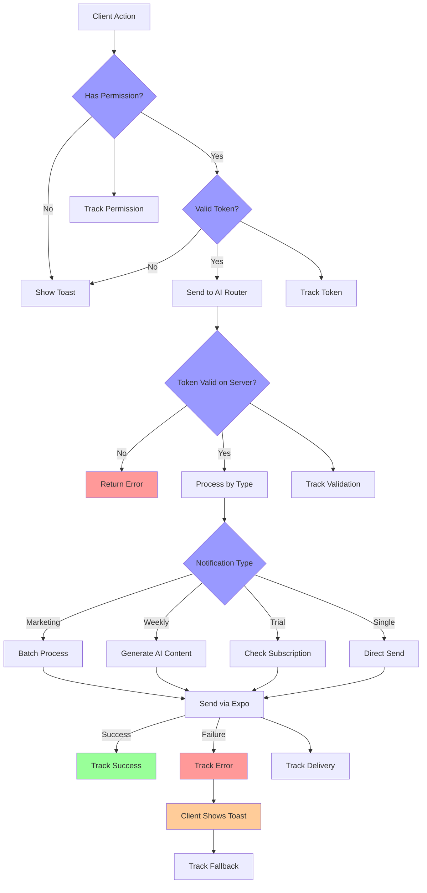

# Soonlist Permissions, Push Tokens, and Notification Routing

## Overview
The Soonlist notification system implements a comprehensive permission and routing system that determines whether to send push notifications or display in-app toasts. This decision-making process involves:
1. Client-side permission management
2. Push token validation
3. Server-side notification processing
4. Fallback to toast messages when needed

## Key Components
1. **NotificationProvider**: Central manager for permissions and tokens
2. **AI Router**: Handles notification sending and validation
3. **RevenueCatProvider**: Example of client-side notification decisions
4. **NotificationHelpers**: Server-side notification processing

## Permission Management Flow

### 1. Permission States
The notification system handles three primary permission states:
- `granted`: User has explicitly allowed notifications
- `denied`: User has explicitly denied notifications
- `undetermined`: User hasn't made a choice yet

### 2. Initial Permission Check
```typescript
const { status: existingStatus } = await Notifications.getPermissionsAsync();
let finalStatus = existingStatus;
if (existingStatus !== "granted") {
  const { status } = await Notifications.requestPermissionsAsync();
  finalStatus = status;
}
```

### 3. Permission Request Flow
1. **Initial Check**
   ```typescript
   const { status: existingStatus } = await Notifications.getPermissionsAsync();
   let finalStatus = existingStatus;
   ```

2. **Permission Request**
   ```typescript
   if (existingStatus !== "granted") {
     const { status } = await Notifications.requestPermissionsAsync();
     finalStatus = status;
   }
   ```

3. **Error Handling**
   ```typescript
   if (finalStatus !== "granted") {
     handleRegistrationError(
       "Permission not granted to get push token for push notification!",
     );
     return;
   }
   ```

4. **UI Feedback**
   ```typescript
   if (!canAskAgain) {
     toast.error("Notification permission required", {
       description: "Please enable notifications in your device settings.",
       action: {
         label: "Settings",
         onClick: () => {
           void Linking.openSettings();
           toast.dismiss();
         },
       },
       duration: Infinity,
     });
     return;
   }
   ```

5. **Permission State Management**
   ```typescript
   saveStep(
     "notifications",
     {
       notificationsEnabled:
         permissionStatus === Notifications.PermissionStatus.GRANTED,
     },
     "/onboarding/02-age",
   );
   ```

### 4. Continuous Permission Monitoring

#### Real-time Permission Tracking
```typescript
useEffect(() => {
  const subscription = AppState.addEventListener("change", (nextAppState) => {
    if (nextAppState === "active") {
      void checkAndUpdateNotificationPermission(setHasNotificationPermission);
    }
  });
  return () => subscription.remove();
}, []);
```

#### Permission Check Implementation
```typescript
async function checkAndUpdateNotificationPermission(
  setPermissionFn: (value: boolean) => void,
) {
  const { status } = await Notifications.getPermissionsAsync();
  setPermissionFn(status === Notifications.PermissionStatus.GRANTED);
}
```

#### Permission Context Management
```typescript
const [hasNotificationPermission, setHasNotificationPermission] = useState(false);
// We track hasNotificationPermission separately. We do NOT rely on the
// one-time outcome of registerForPushNotifications alone. The user might
// later revoke or grant notification permission in device settings.
```

#### Permission UI States
1. **Initial State**
   - Button shows "Allow"
   - User can request permissions

2. **Loading State**
   - Button shows "Loading..."
   - UI is disabled during permission check

3. **Granted State**
   - Button shows "Allowed"
   - UI reflects successful permission grant

4. **Denied State**
   - Shows settings deep link
   - Provides clear instructions for enabling permissions
```

### 2. Continuous Permission Monitoring
```typescript
// NotificationProvider.tsx
useEffect(() => {
  const subscription = AppState.addEventListener("change", (nextAppState) => {
    if (nextAppState === "active") {
      void checkAndUpdateNotificationPermission(setHasNotificationPermission);
    }
  });
  return () => subscription.remove();
}, []);
```

### 3. Permission UI Flow (01-notifications.tsx)
- Initial request during onboarding
- Settings redirection if permissions denied
- Real-time status updates
- Toast fallback for non-permitted states

## Push Token Management

### 1. Token Registration
```typescript
async function registerForPushNotificationsAsync() {
  // Platform-specific setup
  if (Platform.OS === "android") {
    void Notifications.setNotificationChannelAsync("default", {
      name: "default",
      importance: Notifications.AndroidImportance.MAX,
    });
  }

  if (Device.isDevice) {
    // Get project ID for token registration
    const projectId = Constants.expoConfig?.extra?.eas?.projectId;
    
    // Get token
    const pushTokenString = (
      await Notifications.getExpoPushTokenAsync({
        projectId,
      })
    ).data;
    return pushTokenString;
  }
}
```

### 2. Token Validation
```typescript
// Backend validation
if (!Expo.isExpoPushToken(expoPushToken)) {
  return {
    success: false,
    error: "Invalid push token",
    notificationId: generateNotificationId(),
    userId: user.userId,
  };
}
```

### 3. Token Storage
- Stored in database via `pushTokens` table
- Associated with user ID
- Validated before each notification send

## Notification vs Toast Decision Logic

### AI Router Decision Flow

1. **Permission Check**
```typescript
// Check if user has notification permission
if (hasNotificationPermission && expoPushToken) {
  // Send push notification
  void sendNotification.mutate({
    expoPushToken,
    title: "Welcome to Soonlist Unlimited! 🎉",
    body: "Thanks for subscribing! Keep capturing your possibilities.",
    data: { url: "/feed" },
  });
} else {
  // Show toast instead
  toast.info(
    "Welcome to Soonlist Unlimited! 🎉\n\n Enable notifications to get reminders before your trial ends",
    {
      action: {
        label: "Settings",
        onClick: () => {
          void Linking.openSettings();
        },
      },
    },
  );
}
```

2. **Token Validation Flow**
```typescript
// In notification router
export const notificationRouter = createTRPCRouter({
  sendSingleNotification: publicProcedure
    .input(sendNotificationInputSchema)
    .mutation(async ({ ctx, input }) => {
      const { expoPushToken, title, body, data } = input;

      // Validate token
      if (!Expo.isExpoPushToken(expoPushToken)) {
        throw new TRPCError({
          code: "BAD_REQUEST",
          message: "Invalid Expo push token",
        });
      }

      // Proceed with notification
      const notificationId = generateNotificationId();
      const message: ExpoPushMessage = {
        to: expoPushToken,
        sound: "default",
        title,
        body,
        data: {
          ...data,
          notificationId,
        },
      };

      try {
        const [ticket] = await expo.sendPushNotificationsAsync([message]);
        // Track success
        posthog.capture({
          distinctId: ctx.auth.userId || "anonymous",
          event: "notification_sent",
          properties: {
            success: true,
            notificationId,
            type: "single",
            source: "notification_router",
            title,
            hasData: !!data,
            ticketId: getTicketId(ticket),
          },
        });

        return { success: true, ticket };
      } catch (error) {
        // Track failure and return error
        posthog.capture({
          distinctId: ctx.auth.userId || "anonymous",
          event: "notification_sent",
          properties: {
            success: false,
            notificationId,
            type: "single",
            error: (error as Error).message,
            title,
            hasData: !!data,
          },
        });

        return {
          success: false,
          error: (error as Error).message,
        };
      }
    }),
});
```

### Toast Fallback Scenarios

1. **Permission Not Granted**
- When notification permissions are not available
- During onboarding flow
- After permission denial

2. **Invalid Token**
- When push token validation fails
- Device simulator detection
- Token registration errors

3. **Notification Failure**
- Network errors
- Expo service issues
- Token expiration

### Implementation Notes

1. **Permission-Based Routing**
- Always check `hasNotificationPermission` before attempting push
- Provide toast fallback with settings link
- Track user interaction with PostHog

2. **Token Management**
- Validate tokens before each send
- Handle token refresh scenarios
- Track token validation failures

3. **Error Handling**
- Graceful fallback to toast
- User feedback for fixable issues
- Analytics for failure patterns

## Complete Notification Flow


### Analytics Integration
1. **Permission Status Tracking**
   - Track permission request outcomes
   - Monitor permission changes over time
   - Identify permission denial patterns

2. **Token Management Analytics**
   - Track token generation success rate
   - Monitor token validation failures
   - Track token refresh patterns

3. **Notification Delivery Metrics**
   - Success/failure rates by notification type
   - Toast fallback frequency
   - User interaction with notifications

## Notification Types

### 1. Marketing Notifications (Batch Processing)
```typescript
// Marketing notification with batch processing
const message: ExpoPushMessage = {
  to: user.expoPushToken,
  sound: "default",
  title: input.title,
  body: input.body,
  data: {
    ...input.data,
    notificationId,
  },
};
```
- Sent to multiple users simultaneously
- Configurable content via input
- Tracked as marketing events
- Includes batch analytics

### 2. Weekly Notifications (AI-Generated Content)
```typescript
// AI-generated weekly content
const prompt = getPromptForWeeklyNotificationWithEvents(eventDescriptions);
const { text } = await generateText({
  model: anthropic("claude-3-5-sonnet-20240620"),
  prompt,
  temperature: 0,
});
```
- AI-generated content based on user events
- Personalized weekly summaries
- Uses Claude for content generation
- Includes event-specific details

### 3. Trial Notifications (Subscription-Based)
```typescript
// Trial expiration reminder
const message: ExpoPushMessage = {
  to: user.expoPushToken,
  sound: "default",
  title: "2 days left on your trial",
  body: "Your subscription will change from trial to Soonlist Unlimited soon. Keep capturing your possibilities!",
  data: {
    url: "/settings/subscription",
    notificationId,
  },
};
```
- Subscription status-based timing
- Deep links to subscription settings
- Clear call-to-action
- Tracked for conversion analytics

### 4. Single Notifications (Direct User Actions)
```typescript
// Single notification for event creation
const { title, subtitle, body } = getNotificationContent(
  firstEvent.name,
  eventCount,
);
const notificationResult = await sendNotification({
  expoPushToken,
  title,
  subtitle,
  body,
  url: `/event/${eventid}`,
  userId,
  eventId: eventid,
  source: "ai_router",
  method: source,
});
```
- Immediate response to user actions
- Event-specific content
- Deep links to relevant content
- Includes action tracking

## Key Decision Points
1. **Client-Side Decision Logic**

#### Notification vs Toast Decision Flow
```typescript
// Example from RevenueCatProvider.tsx
if (hasNotificationPermission && expoPushToken) {
  void sendNotification.mutate({
    expoPushToken,
    title: "Welcome to Soonlist Unlimited! 🎉",
    body: "Thanks for subscribing! Keep capturing your possibilities.",
    data: { url: "/feed" },
  });
} else {
  toast.info(
    "Welcome to Soonlist Unlimited! 🎉\n\n Enable notifications to get reminders before your trial ends",
    {
      action: {
        label: "Settings",
        onClick: () => {
          void Linking.openSettings();
        },
      },
    },
  );
}
```

#### Decision Factors
1. **Permission Status**
   - Must have explicit user permission
   - Checked via `hasNotificationPermission`
   - Updated on app state changes

2. **Token Validity**
   - Must have valid push token
   - Token checked via `expoPushToken`
   - Token refreshed as needed

3. **Error Handling**
   - Falls back to toast on permission denial
   - Falls back to toast on invalid token
   - Provides settings access when needed

4. **User Experience**
   - Clear feedback on permission status
   - Easy access to settings
   - Consistent fallback behavior

2. **Server-Side**

#### Token Validation Process
```typescript
// Input validation schema
const sendNotificationInputSchema = z.object({
  expoPushToken: z
    .string()
    .refine(
      (token): token is ExpoPushToken => Expo.isExpoPushToken(token),
      "Invalid Expo push token",
    ),
  title: z.string(),
  body: z.string(),
  data: z.record(z.unknown()).optional(),
});

// Token validation before sending
if (!Expo.isExpoPushToken(expoPushToken)) {
  throw new TRPCError({
    code: "BAD_REQUEST",
    message: "Invalid Expo push token",
  });
}
```

#### Notification Processing
```typescript
const message: ExpoPushMessage = {
  to: expoPushToken,
  sound: "default",
  title,
  body,
  data: {
    ...data,
    notificationId,
  },
};

const [ticket] = await expo.sendPushNotificationsAsync([message]);
```

#### Error Tracking and Analytics
```typescript
posthog.capture({
  distinctId: ctx.auth.userId || "anonymous",
  event: "notification_sent",
  properties: {
    success: true,
    notificationId,
    type: "single",
    source: "notification_router",
    title,
    hasData: !!data,
    ticketId: getTicketId(ticket),
  },
});
```

Important: The AI router handles notification sending and validation but does not make toast vs notification decisions. Those decisions are made on the client side based on permission status and token validity.

3. **AI Router Role**
   - Validates tokens before sending notifications
   - Processes notifications based on type (marketing, weekly, trial, single)
   - Returns detailed success/failure status with error context
   - Tracks notification delivery metrics via PostHog
   - Does not make toast vs notification decisions (client responsibility)
   - Handles notification content generation for specific types
   - Manages batch notification processing
   - Provides error context for client-side fallback handling

### Notification Processing Flow
1. **Token Validation**
   ```typescript
   if (!Expo.isExpoPushToken(expoPushToken)) {
     throw new TRPCError({
       code: "BAD_REQUEST",
       message: "Invalid Expo push token",
     });
   }
   ```

2. **Notification Sending**
   ```typescript
   const [ticket] = await expo.sendPushNotificationsAsync([message]);
   ```

3. **Analytics Tracking**
   ```typescript
   posthog.capture({
     distinctId: userId,
     event: "notification_sent",
     properties: {
       success: true,
       notificationId,
       type: "event_creation",
       source: "ai_router",
       method: source,
     },
   });
   ```

## Critical Considerations

1. **Permission State Management**
- Real-time permission status tracking via AppState monitoring
- Settings deep link handling for permission management
- Cross-platform differences (iOS vs Android)
- Permission state persistence across app restarts

2. **Token Lifecycle**

#### Token Generation and Registration
```typescript
// Platform-specific setup
if (Platform.OS === "android") {
  void Notifications.setNotificationChannelAsync("default", {
    name: "default",
    importance: Notifications.AndroidImportance.MAX,
    vibrationPattern: [0, 250, 250, 250],
    lightColor: "#FF231F7C",
  });
}

// Project ID validation
const projectId = Constants.expoConfig?.extra?.eas?.projectId;
if (!projectId) {
  handleRegistrationError("Project ID not found");
}

// Token generation
try {
  const pushTokenString = (
    await Notifications.getExpoPushTokenAsync({
      projectId,
    })
  ).data;
  return pushTokenString;
} catch (e: unknown) {
  handleRegistrationError(`${e}`);
}
```

#### Token Management Flow
1. **Platform Setup**
   - Configure Android notification channel
   - Set importance and vibration pattern
   - Configure light color for notifications

2. **Project Validation**
   - Get project ID from Expo config
   - Validate project ID existence
   - Handle missing project ID errors

3. **Token Generation**
   - Request push token from Expo
   - Validate token format
   - Handle generation errors

4. **Token Storage**
   - Store token in state
   - Update token on permission changes
   - Handle token refresh scenarios

5. **Token Validation**
   ```typescript
   if (!Expo.isExpoPushToken(expoPushToken)) {
     return {
       success: false,
       error: "Invalid push token",
       notificationId: generateNotificationId(),
       userId: user.userId,
     };
   }
   ```

3. **User Experience**
- Consistent fallback messaging with actionable steps
- Clear permission value proposition during onboarding
- Easy settings access through deep linking
- Graceful degradation to toast notifications
- Real-time feedback on permission changes

4. **Error Handling and Fallback Strategies**

#### Error Categories
1. **Permission Errors**
   ```typescript
   if (!canAskAgain) {
     toast.error("Notification permission required", {
       description: "Please enable notifications in your device settings.",
       action: {
         label: "Settings",
         onClick: () => void Linking.openSettings(),
       },
     });
     return;
   }
   ```

2. **Token Validation Errors**
   ```typescript
   if (!Expo.isExpoPushToken(expoPushToken)) {
     return {
       success: false,
       error: "Invalid push token",
       notificationId: generateNotificationId(),
       userId: user.userId,
     };
   }
   ```

3. **Network Errors**
   ```typescript
   catch (error) {
     console.error("Error sending notification:", error);
     return {
       success: false,
       error: error instanceof Error ? error.message : "Unknown error occurred",
     };
   }
   ```

4. **Device Errors**
   ```typescript
   if (!Device.isDevice) {
     handleRegistrationError("Must use physical device for push notifications");
   }
   ```

#### Fallback Strategies
1. **Permission Fallbacks**
   - Show settings deep link on denial
   - Provide clear instructions
   - Maintain persistent UI state

2. **Token Fallbacks**
   - Attempt token refresh
   - Fall back to toast notifications
   - Track failed attempts

3. **Network Fallbacks**
   - Retry failed notifications
   - Queue important notifications
   - Show offline indicators

4. **Analytics Integration**
   ```typescript
   posthog.capture({
     distinctId: userId,
     event: "notification_sent",
     properties: {
       success: false,
       notificationId,
       type: "single",
       error: error.message,
       hasData: !!data,
     },
   });
   ```

5. **Security Considerations**
- Token validation on both client and server
- Permission state verification
- Secure token storage
- Rate limiting and abuse prevention
