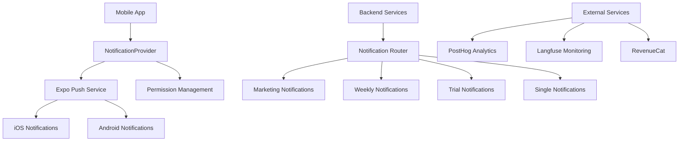
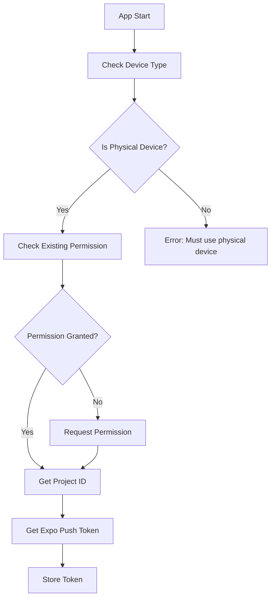

# Soonlist Notification System Documentation

## Executive Summary
The Soonlist notification system is built on Expo's push notification infrastructure, providing a robust cross-platform solution for user engagement. The system handles various notification types including marketing campaigns, weekly event summaries, trial notifications, and user-specific alerts. Key features include AI-generated content, deep linking, and comprehensive analytics tracking.

## Architecture Overview


The notification system in Soonlist is built on Expo's notification infrastructure, utilizing `expo-notifications` for cross-platform push notification support. The system is implemented through a React Context provider pattern, allowing global access to notification functionality throughout the app.

## Core Components and Interactions

### 1. NotificationProvider (Mobile App)
- **Location**: `apps/expo/src/providers/NotificationProvider.tsx`
- **Primary Responsibilities**:
  - Token registration and management
  - Permission handling
  - Event listeners and routing
  - Deep linking integration
  - Analytics tracking

### 2. Permission Management
- **User Flow**: Implemented in `01-notifications.tsx`
- **Features**:
  - Initial permission request
  - Settings redirection
  - Real-time status monitoring
  - Platform-specific handling

### 3. Notification Router (Backend)
- **Location**: `packages/api/src/routers/notification.ts`
- **Endpoints**:
  - Marketing notifications
  - Single notifications
  - Weekly notifications
  - Trial notifications
- **Features**:
  - Batch processing
  - Error handling
  - Analytics integration
  - AI content generation

### 4. External Service Integrations
- **Expo Push Service**: Core notification delivery
- **PostHog**: Analytics and tracking
- **Langfuse**: AI monitoring
- **RevenueCat**: Subscription management

## Platform-Specific Configuration

### iOS Implementation
```typescript
// app.config.ts iOS configuration
ios: {
  supportsTablet: false,
  bundleIdentifier: getUniqueIdentifier(),
  infoPlist: {
    UIBackgroundModes: ["fetch"],
    CFBundleURLTypes: [
      {
        CFBundleURLName: "Soonlist Schemes",
        CFBundleURLSchemes: getSchemes(),
      }
    ],
  },
  associatedDomains: ["applinks:www.soonlist.com"],
}
```
- Background fetch mode enabled
- Deep linking configuration
- Minimum deployment target: 15.1
- URL scheme handling
- Associated domains for universal links

### Android Implementation
```typescript
// Android notification channel setup
if (Platform.OS === "android") {
  void Notifications.setNotificationChannelAsync("default", {
    name: "default",
    importance: Notifications.AndroidImportance.MAX,
    vibrationPattern: [0, 250, 250, 250],
    lightColor: "#FF231F7C",
  });
}

// app.config.ts Android configuration
android: {
  package: getUniqueIdentifier(),
  adaptiveIcon: {
    foregroundImage: "./assets/adaptive-icon.png",
    backgroundColor: "#ffffff",
  },
}
```
- Default notification channel configuration
- Maximum importance level for notifications
- Custom vibration pattern implementation
- Adaptive icon support
- Package identifier management
- **Location**: `apps/expo/src/providers/NotificationProvider.tsx`
- **Purpose**: Central management of notification state and functionality
- **Responsibilities**:
  - Push token management
  - Permission handling
  - Notification event listeners
  - Deep linking integration
  - Analytics tracking (PostHog integration)

### 2. Notification Permission UI
- **Location**: `apps/expo/src/app/(onboarding)/onboarding/01-notifications.tsx`
- **Purpose**: User-facing notification permission flow
- **Features**:
  - Permission request UI
  - Settings redirection
  - Permission status management

## Notification Flow

### 1. Token Registration


### 2. Permission Management
- **Initial Check**: `getPermissionsAsync()` checks existing permissions
- **Request Flow**: 
  1. Check if permission already granted
  2. Verify if can ask again
  3. Request permission if needed
  4. Redirect to settings if necessary
- **Continuous Monitoring**: Permission status checked on app focus

### 3. Notification Handling

#### Registration
```typescript
// Platform-specific setup
if (Platform.OS === "android") {
  // Configure default channel
  importance: Notifications.AndroidImportance.MAX
  vibrationPattern: [0, 250, 250, 250]
}
```

#### Event Listeners
1. **Notification Received**:
   - Captures notification data
   - Logs analytics via PostHog
   - Updates app state

2. **Notification Response**:
   - Handles user interaction
   - Processes deep links
   - Tracks user engagement

### 4. Platform-Specific Implementations

#### iOS
- Background modes enabled for fetch
- Associated domains configured for deep linking
- Minimum deployment target: 15.1

#### Android
- Default notification channel configured
- Maximum importance level set
- Custom vibration pattern

## Notification Processing by App State

### Foreground State
- **Handler Configuration**:
  ```typescript
  Notifications.setNotificationHandler({
    handleNotification: async () => ({
      shouldShowAlert: true,
      shouldPlaySound: false,
      shouldSetBadge: false,
    }),
  });
  ```
- **Processing Flow**:
  1. Notification received via `addNotificationReceivedListener`
  2. Updates app state via `setNotification`
  3. Triggers PostHog analytics
  4. Shows alert (configured in handler)

### Background State
- **iOS Configuration**: 
  - Background fetch mode enabled via `UIBackgroundModes: ["fetch"]`
  - Allows processing notifications when app is in background
- **Processing Flow**:
  1. System receives push notification
  2. Notification displayed in system tray
  3. On user interaction, handled by `addNotificationResponseReceivedListener`
  4. Deep linking processed if URL present
  5. Analytics captured for background interaction

### App Launch from Notification
- **Implementation**: `getLastNotificationResponseAsync`
- **Processing Flow**:
  1. Check for launching notification on app start
  2. Process deep links if present
  3. Route to appropriate screen
  4. Track analytics for launch source

### State Monitoring
- App state changes monitored via `AppState.addEventListener`
- Permission status re-checked on app becoming active
- Notification subscriptions properly cleaned up on component unmount

### Discussion Points
- **Background Fetch Implementation**: The app has background fetch mode enabled (`UIBackgroundModes: ["fetch"]`) but the implementation details are not immediately clear in the notification system code. This might affect how notifications are processed in the background state and should be clarified with the team.

## Complex Patterns and Discussion Points

### Areas Requiring Attention
1. **Background Fetch Implementation**
   - Background fetch mode is enabled but implementation details are not immediately clear
   - Potential impact on notification processing in background state
   - Recommendation: Review and document background fetch handlers

2. **Token Persistence Strategy**
   - Current implementation focuses on runtime token management
   - Consider documenting token storage and refresh mechanisms
   - Potential for token synchronization issues across devices

3. **AI Content Generation**
   - Weekly notifications use Claude for content generation
   - Consider documenting fallback strategies for AI service outages
   - Monitor content quality and user engagement metrics

## Critical Implementation Details

1. **Token Management**
   - Tokens are environment-specific (dev/preview/prod)
   - Project ID required for token generation
   - Error handling for token generation failures

2. **Deep Linking**
   - Notifications can contain URL data for routing
   - Router integration via expo-router
   - URL validation before navigation

3. **Permission Edge Cases**
   - Handles permission revocation in settings
   - Provides settings redirect when needed
   - Maintains real-time permission status

4. **Analytics Integration**
   - Tracks notification events:
     - Received
     - Opened
     - Deep link usage
   - Captures notification metadata

## Backend Integration Points

### Notification API Endpoints (notification.ts)
1. **Marketing Notifications**
   - Endpoint: `sendMarketingNotification`
   - Purpose: Sends batch notifications to all users
   - Security: Protected by CRON_SECRET
   - Analytics: PostHog tracking for batch results

2. **Single Notifications**
   - Endpoint: `sendSingleNotification`
   - Purpose: Sends targeted notification to specific user
   - Validation: Expo token validation
   - Analytics: PostHog tracking per notification

3. **Weekly Notifications**
   - Endpoint: `sendWeeklyNotifications`
   - Purpose: Sends personalized weekly event summaries
   - Features:
     - AI-generated content using Claude
     - Event aggregation
     - Langfuse tracking
   - Analytics: PostHog tracking

4. **Trial Expiration Reminders**
   - Endpoint: `sendTrialExpirationReminders`
   - Purpose: Subscription-related notifications
   - Targeting: Users 5 days into trial
   - Integration: RevenueCat subscription data

### Notification Service Integration (NotificationProvider.tsx)
1. **Token Management**
   - Registration with Expo servers
   - Project ID validation
   - Platform-specific token handling

2. **Analytics Integration**
   - PostHog event tracking
   - Notification received events
   - Notification opened events
   - Deep link usage tracking

3. **Deep Linking**
   - Integration with expo-router
   - URL-based navigation
   - Event-specific routing

### External Service Dependencies
1. **Expo Push Service**
   ```typescript
   const expo = new Expo();
   await expo.sendPushNotificationsAsync([message]);
   ```

2. **PostHog Analytics**
   - Tracks notification delivery
   - Monitors user engagement
   - Batch statistics

3. **Langfuse Monitoring**
   - AI-generated content tracking
   - Performance monitoring
   - Error tracking

4. **RevenueCat Integration**
   - Subscription status notifications
   - Trial expiration reminders
   - Welcome notifications

### Error Handling and Monitoring
1. **Token Validation**
   ```typescript
   if (!Expo.isExpoPushToken(expoPushToken)) {
     return { success: false, error: "Invalid push token" };
   }
   ```

2. **Delivery Tracking**
   - Success/failure monitoring
   - Error aggregation
   - Batch statistics

3. **Analytics Pipeline**
   - Multi-service tracking
   - User engagement metrics
   - System health monitoring

## Configuration

### Environment-Specific Settings
```typescript
const getUniqueIdentifier = () => {
  if (IS_DEV) return "com.soonlist.app.dev";
  if (IS_PREVIEW) return "com.soonlist.app.preview";
  return "com.soonlist.app";
};
```

### Build Configuration
- Managed via EAS
- Environment-specific channels
- Automatic version increments in production

## Security Considerations
- Token validation required
- Permission status verification on sensitive operations
- Deep link URL validation
