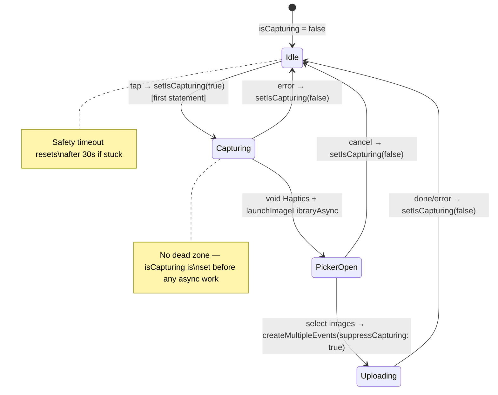

# fix: Capture button frozen after picker dismiss and visibility flicker on route transitions

## Overview

The `CaptureOverlayButton` has two bugs: (1) after dismissing the native photo picker, the button sometimes becomes unresponsive or permanently frozen, and (2) the button vanishes and reappears abruptly during modal route transitions. Both make the app feel unstable.

## Problem Frame

**Frozen state / post-dismiss delay:** The button uses a two-layer guard: a synchronous `pressLockRef` (set `true` on tap) and the `isCapturing` Zustand store (set `true` inside the async flow). The `pressLockRef` resets via `useEffect` when `isCapturing` transitions back to `false`. This creates a **dead zone**: if `triggerAddEventFlow` fails *between* setting `pressLockRef = true` and calling `setIsCapturing(true)` (e.g., `await Haptics.selectionAsync()` throws), then `isCapturing` was never set `true`, so it never transitions to `false`, and the `useEffect` never fires to reset `pressLockRef`. The button looks enabled but silently swallows all taps. Even in the happy path, the `useEffect`-based reset introduces a one-render-cycle delay after picker dismiss before the button becomes tappable again.

**Visibility flicker:** `usePathname()` updates when React Navigation commits the state change — before the screen transition animation completes. The button does a hard `return null` (no animation) when the path leaves the allowlist, causing it to pop out on modal open and pop back in on modal dismiss.

## Requirements Trace

- R1. Capture button must become tappable immediately after photo picker dismiss (no render-cycle delay)
- R2. Capture button must never get permanently stuck in a frozen state
- R3. Capture button must not vanish/reappear abruptly during modal present/dismiss animations
- R4. All capture entry points (5 call sites) must be protected against concurrent capture flows
- R5. No regressions to existing capture flow (photo picker, event creation, offline behavior)

## Scope Boundaries

- Not changing the capture flow itself (photo picker → event creation pipeline)
- Not moving the button into `NativeTabs.BottomAccessory` (evaluated and ruled out — dual-instance issue)
- Not changing the pathname-based visibility strategy (`usePathname` is the right hook)
- Not adding retry for failed uploads (separate feature)

## Context & Research

### Relevant Code and Patterns

- `apps/expo/src/components/CaptureOverlayButton.tsx` — FAB overlay, `pressLockRef` guard (lines 56-61), `disabled={!isOnline || isCapturing}` (line 103), `handlePress` with two-layer check (line 74-85)
- `apps/expo/src/hooks/useAddEventFlow.ts` — `await Haptics.selectionAsync()` before `setIsCapturing(true)` (lines 24-27), no early `isCapturing` guard
- `apps/expo/src/hooks/useCreateEvent.ts` — `createMultipleEvents` independently calls `setIsCapturing(true/false)` (lines 222, 299); `createEvent` has `suppressCapturing` param but `createMultipleEvents` does not
- `apps/expo/src/store/useInFlightEventStore.ts` — bare `isCapturing` boolean in Zustand store
- `apps/expo/src/components/AddEventButton.tsx` — calls `triggerAddEventFlow` but `disabled` only checks `!isOnline`, not `isCapturing`
- `apps/expo/src/components/UserEventsList.tsx` — 3 call sites (lines ~812, ~847, ~1007) with zero guards

### Reanimated Layout Animation Patterns in Codebase

- `apps/expo/src/components/UserEventsList.tsx` — `FadeInDown`, `FadeInLeft` with `.delay().duration().springify()`
- `apps/expo/src/components/SignInWithOAuth.tsx` — `FadeIn.duration(400)`, `FadeOut.duration(300)`
- `apps/expo/src/app/(onboarding)/01-try-it.tsx` — `FadeIn.duration(...)` with delays

### Technology Versions

Expo SDK 55.0.0-preview.12, React Native 0.83.2, react-native-reanimated 4.2.2, Zustand 4.5.5

## Key Technical Decisions

- **Move `setIsCapturing(true)` before the haptic call and make haptic fire-and-forget:** This eliminates the dead zone between `pressLockRef = true` and `setIsCapturing(true)`. The haptic becomes `void Haptics.selectionAsync()` — non-blocking, non-throwable from the flow's perspective. This is the core fix for the frozen state bug.
- **Add early `isCapturing` guard inside `triggerAddEventFlow` itself:** A single `if (isCapturing) return` at the top of the function protects all 5 call sites without requiring each component to add its own guard. This addresses R4.
- **Remove `pressLockRef` entirely:** Once `setIsCapturing(true)` is the very first statement in `triggerAddEventFlow` (synchronous, before any async work), the Zustand store becomes the single source of truth. The `disabled` prop + the in-function guard handle all concurrency. No more `useEffect`-based reset, no more render-cycle delay. This addresses R1.
- **Add `suppressCapturing` to `createMultipleEvents`:** Single owner of `isCapturing` lifecycle — only `triggerAddEventFlow` sets it. Eliminates redundant nested state management.
- **Add safety timeout:** A ~30s timeout that resets `isCapturing` to `false` if it gets stuck, as a last-resort recovery mechanism for any unknown edge case. Addresses R2.
- **Animated visibility with Reanimated layout animations:** Replace hard `return null` with `FadeIn`/`FadeOut` entering/exiting animations on the button, following existing codebase patterns. Addresses R3.

## Open Questions

### Resolved During Planning

- **Should `pressLockRef` be kept as a secondary guard?** No. Once `setIsCapturing(true)` is synchronous and first, the Zustand read is sufficient. Removing it eliminates both the dead zone and the render-cycle delay bugs.
- **Should each secondary call site add its own guard?** No. The guard belongs inside `triggerAddEventFlow` itself — one guard, all call sites protected.
- **Should `AddEventButton` also check `isCapturing` in its disabled prop?** Yes, one-line fix. Currently it only checks `!isOnline`.

### Deferred to Implementation

- Exact Reanimated animation duration/delay values (start with 200ms enter / 150ms exit, tune empirically)
- Whether the safety timeout should live in the Zustand store or in `CaptureOverlayButton`'s effect

## High-Level Technical Design

> *This illustrates the intended approach and is directional guidance for review, not implementation specification. The implementing agent should treat it as context, not code to reproduce.*

## Implementation Units

- [x] **Unit 1: Fix capture state lifecycle — eliminate dead zone, remove pressLockRef, single state owner**

  **Goal:** Make the capture button immediately responsive after picker dismiss and eliminate the permanent frozen state. Protect all call sites against concurrent captures.

  **Requirements:** R1, R2, R4, R5

  **Dependencies:** None

  **Files:**
  - Modify: `apps/expo/src/hooks/useAddEventFlow.ts`
  - Modify: `apps/expo/src/components/CaptureOverlayButton.tsx`
  - Modify: `apps/expo/src/hooks/useCreateEvent.ts`
  - Modify: `apps/expo/src/components/AddEventButton.tsx`

  **Approach:**
  - In `triggerAddEventFlow`: add early `if (useInFlightEventStore.getState().isCapturing) return` guard at the top of the callback — must use `getState()` for a synchronous fresh read, not a hook-based selector (which would be stale inside the `useCallback` closure). Move `setIsCapturing(true)` to be the first statement (before haptic). Change haptic to fire-and-forget: `void Haptics.selectionAsync()`. Ensure all exit paths (cancel, error, success) call `setIsCapturing(false)` — already true today, just verify.
  - In `CaptureOverlayButton`: remove `pressLockRef`, the `useEffect` that resets it, and the `pressLockRef.current` check in `handlePress`. The button now relies solely on `isCapturing` store read + `disabled` prop. The `handlePress` simplifies to: `if (isCapturing) return; void triggerAddEventFlow();`
  - In `createMultipleEvents`: add `suppressCapturing` parameter (default `false`). When `true`, skip the `setIsCapturing(true/false)` calls. Pass `suppressCapturing: true` from `triggerAddEventFlow`.
  - In `AddEventButton`: add `isCapturing` to the `disabled` condition. Also fix the existing bare store usage (`useInFlightEventStore()` without selector) to use proper selectors per `.cursor/rules/zustand.mdc`
  - Add a safety timeout: when `setIsCapturing(true)` fires, schedule a 30s timeout that resets to `false`. Clear the timeout when `setIsCapturing(false)` fires normally. This can live as a `useEffect` in `CaptureOverlayButton` or as a store-level mechanism.

  **Patterns to follow:**
  - Existing `suppressCapturing` parameter on `createEvent`
  - Zustand selector pattern per `.cursor/rules/zustand.mdc`

  **Test scenarios:**
  - Happy path: Tap button, cancel picker → button is tappable on the very next tap (no delay)
  - Happy path: Tap button, select images, wait for upload → button becomes tappable after upload completes
  - Happy path: Capture from secondary CTA (SourceStickersRow) → works, button disabled during capture
  - Edge case: Rapid double-tap on button → only one picker opens (early guard in triggerAddEventFlow returns)
  - Edge case: Tap secondary CTA while FAB capture is in flight → second call returns immediately
  - Error path: If haptic call would throw → `isCapturing` is already true, flow continues, no frozen state
  - Error path: If photo picker throws → `isCapturing` reset in catch block, button recovers
  - Error path: Safety timeout fires after 30s → `isCapturing` resets, button becomes tappable, any in-flight upload continues unaffected (upload doesn't check `isCapturing`)
  - Integration: `createMultipleEvents` called from `triggerAddEventFlow` with `suppressCapturing: true` → no redundant `setIsCapturing` calls; called from elsewhere without flag → still manages its own state

  **Verification:**
  - After dismissing photo picker (cancel), button is immediately tappable — no delay
  - Button never gets permanently stuck in frozen/unresponsive state
  - All 5 call sites are protected against concurrent capture flows

- [x] **Unit 2: Add animated enter/exit to CaptureOverlayButton**

  **Goal:** Replace hard `return null` with Reanimated entering/exiting animations so the button fades smoothly during route transitions instead of popping in/out.

  **Requirements:** R3

  **Dependencies:** None (can be done in parallel with Unit 1)

  **Files:**
  - Modify: `apps/expo/src/components/CaptureOverlayButton.tsx`

  **Approach:**
  - Keep the outer absolutely-positioned `View` container always rendered (with `pointerEvents="box-none"`)
  - Conditionally render the `Pressable` (and its children) inside a Reanimated `Animated.View` with `entering` and `exiting` props, gated on `isOnTabRoute`
  - Use `FadeIn.duration(200).delay(100)` for entering (delay gives modal dismiss animation a head start) and `FadeOut.duration(150)` for exiting
  - Wrap with `LayoutAnimationConfig skipEntering` to prevent animation on initial app mount
  - Preserve `zIndex: 100` and `pointerEvents` behavior

  **Patterns to follow:**
  - `apps/expo/src/components/SignInWithOAuth.tsx` — `FadeIn.duration(400)`, `FadeOut.duration(300)`
  - `apps/expo/src/app/(onboarding)/01-try-it.tsx` — `FadeIn.duration(...)` with delays

  **Test scenarios:**
  - Happy path: Navigate from `/feed` to `/event/[id]` modal → button fades out smoothly, not instant vanish
  - Happy path: Dismiss `/event/[id]` modal back to `/feed` → button fades in after slight delay, not instant pop
  - Edge case: Rapid open/dismiss of modal → animations don't glitch or stack
  - Edge case: App launch → button appears immediately without fade-in (skipEntering)
  - Edge case: Navigate to non-tab route like `/settings` → button still hidden (no change to allowlist)

  **Verification:**
  - Modal present/dismiss transitions feel smooth — no jarring pop in/out
  - No animation on initial app launch

## System-Wide Impact

- **Interaction graph:** `triggerAddEventFlow` is the chokepoint — all 5 call sites funnel through it. The early guard and state reordering protect the entire capture surface.
- **Error propagation:** No change to error handling paths in `useCreateEvent`. The safety timeout is additive (last-resort recovery), not a replacement for existing finally blocks.
- **State lifecycle risks:** Removing `pressLockRef` simplifies the lifecycle to a single boolean in Zustand. The intermediate complexity (two-layer guard with render-cycle coupling) is the root cause of both bugs.
- **API surface parity:** `createMultipleEvents` gains a `suppressCapturing` parameter (default false) — backward compatible. `AddEventButton` gains `isCapturing` in its disabled condition.
- **Unchanged invariants:** Photo picker selection, image optimization, batch creation, event upload, offline disabling, pathname allowlist routes.

## Risks & Dependencies

| Risk | Mitigation |
|------|------------|
| Reanimated layout animations conflict with absolute positioning / zIndex | Existing codebase uses these animations successfully; fall back to opacity via `useAnimatedStyle` if entering/exiting misbehave |
| Safety timeout fires during legitimate long upload (20 images) | 30s is generous; timeout only resets `isCapturing`, doesn't cancel the upload |
| Removing `pressLockRef` allows a double-tap during Zustand read latency | Zustand reads are synchronous (~0ms); the early guard in `triggerAddEventFlow` provides a second layer |

## Sources & References

- Related issue: #967
- Related code: `apps/expo/src/components/CaptureOverlayButton.tsx`, `apps/expo/src/hooks/useAddEventFlow.ts`, `apps/expo/src/hooks/useCreateEvent.ts`
- Expo Router source: `usePathname()` uses `useSyncExternalStore`, updates before animation completes
- Reanimated layout animations: `FadeIn`, `FadeOut`, `LayoutAnimationConfig`
