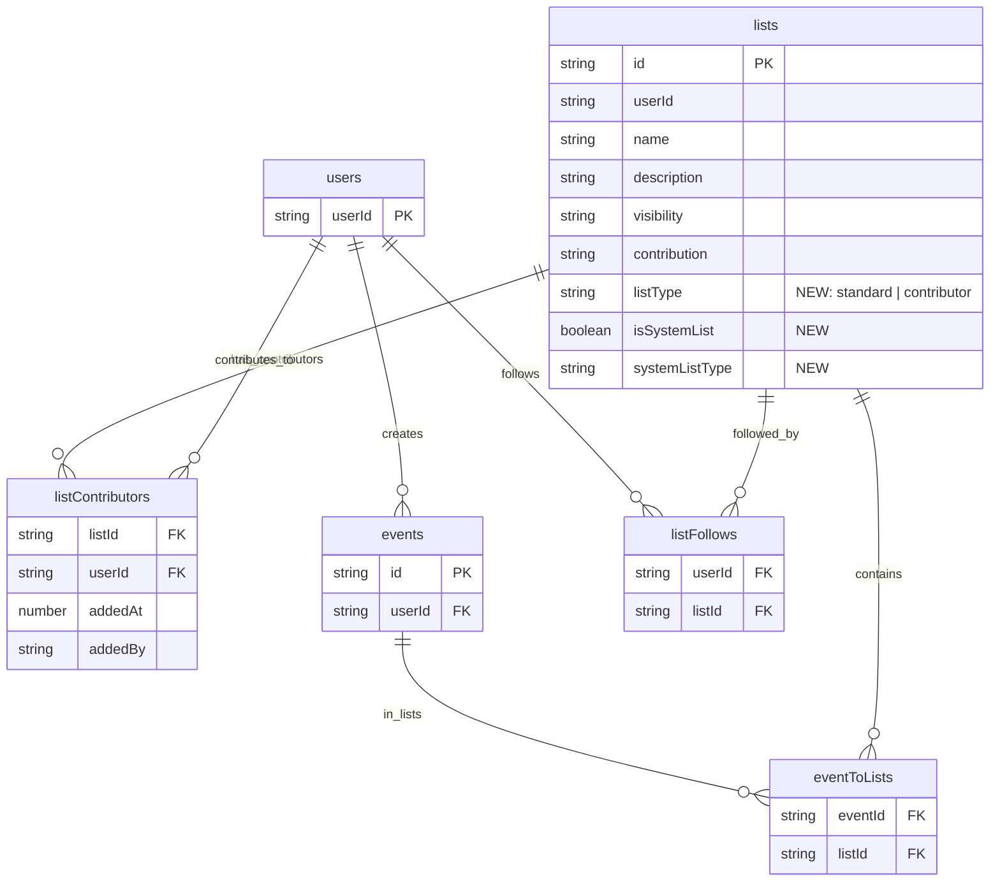

# feat: Migrate Discover Feed to a Followed List

## Overview

Transform the current "Discover" feed into a followable "PDX Discover" list through a phased approach. Users who previously had `showDiscover=true` become contributors to this list, and all users can follow/unfollow it.

**Goal:** Discover → "PDX Discover" list → users follow it → unified Following feed experience.

## Problem Statement / Motivation

Currently, Soonlist has two separate feed experiences:

1. **Discover feed** (`feedId: "discover"`) - Public events from users with `showDiscover=true`
2. **Following feed** (`feedId: "followedUsers_${userId}"`) - Events from followed users

This creates:

- Fragmented experience (checking two tabs)
- No way to opt-out of Discover content
- No clear path for users to share their events publicly via lists

By converting Discover into a multi-user list:

- Users get unified feed experience
- Content creators become list contributors (clearer mental model)
- Users can follow/unfollow the Discover list
- Sets foundation for other community lists (e.g., "Seattle Events", "Music Events")

---

## Proposed Solution: Three-Phase Approach

### Phase 1: Prepare & Communicate (This PR)

- Keep both Following and Explore/Discover feeds
- Add messaging on Following screen about upcoming changes
- Add note about public event sharing as lists
- Implement feed de-duplication

### Phase 2: Multi-User List Infrastructure

- Build "contributor lists" - lists where member users' events auto-populate
- Add `listContributors` table linking users to lists
- When a contributor creates a public event, it auto-appears in their contributor lists

### Phase 3: Migrate Discover → "PDX Discover" List

- Create "PDX Discover" list using new infrastructure
- Migrate `showDiscover=true` users to become list contributors
- Auto-follow all existing users to the list
- Remove Discover tab from mobile app

---

## Technical Approach

### Phase 1: Prepare & Communicate

**1.1 Add transition messaging to Following screen**

```typescript
// apps/expo/src/app/(tabs)/following.tsx

function TransitionBanner() {
  return (
    <View className="bg-interactive-3 p-4 rounded-lg mx-4 mb-4">
      <Text className="text-neutral-1 font-semibold">
        Coming Soon: Discover becomes a list!
      </Text>
      <Text className="text-neutral-2 text-sm mt-1">
        Soon you'll be able to follow "PDX Discover" like any other list.
        You can also share all your events publicly by creating your own list.
      </Text>
    </View>
  );
}
```

**1.2 De-duplicate events across feeds**

Events may appear in both Following (via user follows) and Discover. Add de-duplication:

```typescript
// apps/expo/src/app/(tabs)/following.tsx
// When displaying events from multiple sources, dedupe by eventId

const allEvents = [...followedUsersEvents, ...followedListsEvents];
const uniqueEvents = Array.from(
  new Map(allEvents.map((e) => [e.id, e])).values(),
);
```

**Files to modify:**

- `apps/expo/src/app/(tabs)/following.tsx` - Add banner, dedupe logic

**Acceptance Criteria - Phase 1:**

- [ ] Transition banner displays on Following screen
- [ ] Events are de-duplicated when appearing in multiple feeds
- [ ] No breaking changes to existing functionality

---

### Phase 2: Multi-User List Infrastructure

**2.1 Add contributor lists schema**

```typescript
// packages/backend/convex/schema.ts

// NEW TABLE: Links users as contributors to lists
listContributors: defineTable({
  listId: v.string(),           // List ID
  userId: v.string(),           // Contributing user
  addedAt: v.number(),          // When they became a contributor
  addedBy: v.optional(v.string()), // Who added them (for moderation)
})
  .index("by_list", ["listId"])
  .index("by_user", ["userId"])
  .index("by_list_and_user", ["listId", "userId"]),

// UPDATE lists table
lists: defineTable({
  // ... existing fields ...
  listType: v.optional(v.union(
    v.literal("standard"),      // Normal list (events added manually)
    v.literal("contributor"),   // Events auto-added from contributors
  )),
  isSystemList: v.optional(v.boolean()),  // Official Soonlist lists
  systemListType: v.optional(v.string()), // "discover" | "featured" | etc.
})
  .index("by_system_type", ["isSystemList", "systemListType"]),
```

**2.2 Auto-add contributor events to list**

When a contributor creates a public event, auto-add to their contributor lists:

```typescript
// packages/backend/convex/feedHelpers.ts

export const addEventToContributorLists = internalMutation({
  args: {
    eventId: v.string(),
    userId: v.string(),
  },
  handler: async (ctx, { eventId, userId }) => {
    // Find all contributor lists this user belongs to
    const contributions = await ctx.db
      .query("listContributors")
      .withIndex("by_user", (q) => q.eq("userId", userId))
      .collect();

    for (const contribution of contributions) {
      const list = await ctx.db
        .query("lists")
        .withIndex("by_custom_id", (q) => q.eq("id", contribution.listId))
        .first();

      // Only auto-add to contributor-type lists
      if (list?.listType !== "contributor") continue;

      // Check if event already in list
      const existing = await ctx.db
        .query("eventToLists")
        .withIndex("by_event_and_list", (q) =>
          q.eq("eventId", eventId).eq("listId", contribution.listId),
        )
        .first();

      if (!existing) {
        await ctx.db.insert("eventToLists", {
          eventId,
          listId: contribution.listId,
          addedAt: Date.now(),
        });

        // Fanout to list followers
        await ctx.runMutation(
          internal.feedHelpers.addEventToListFollowersFeeds,
          {
            listId: contribution.listId,
            eventId,
          },
        );
      }
    }
  },
});
```

**2.3 Update event creation to use contributor lists**

```typescript
// packages/backend/convex/feedHelpers.ts - updateEventInFeeds function

// After creating event, add to contributor lists
if (visibility === "public") {
  await ctx.runMutation(internal.feedHelpers.addEventToContributorLists, {
    eventId,
    userId,
  });
}
```

**2.4 Add/remove contributor mutations**

```typescript
// packages/backend/convex/lists.ts

export const addContributor = mutation({
  args: {
    listId: v.string(),
    contributorUserId: v.string(),
  },
  handler: async (ctx, { listId, contributorUserId }) => {
    // Verify list exists and is contributor type
    const list = await getListById(ctx, listId);
    if (!list) throw new ConvexError("List not found");
    if (list.listType !== "contributor") {
      throw new ConvexError("Cannot add contributors to standard lists");
    }

    // Check permissions (owner or admin)
    const userId = await getUserId(ctx);
    if (list.userId !== userId) {
      throw new ConvexError("Only list owner can add contributors");
    }

    // Add contributor
    await ctx.db.insert("listContributors", {
      listId,
      userId: contributorUserId,
      addedAt: Date.now(),
      addedBy: userId,
    });

    // Backfill their existing public events to the list
    await ctx.runMutation(internal.feedHelpers.addUserEventsToContributorList, {
      listId,
      userId: contributorUserId,
    });

    return { success: true };
  },
});

export const removeContributor = mutation({
  args: {
    listId: v.string(),
    contributorUserId: v.string(),
  },
  handler: async (ctx, { listId, contributorUserId }) => {
    // Similar permission checks...

    // Remove contributor record
    const contribution = await ctx.db
      .query("listContributors")
      .withIndex("by_list_and_user", (q) =>
        q.eq("listId", listId).eq("userId", contributorUserId),
      )
      .first();

    if (contribution) {
      await ctx.db.delete(contribution._id);
    }

    // Optionally remove their events from the list
    await ctx.runMutation(
      internal.feedHelpers.removeUserEventsFromContributorList,
      {
        listId,
        userId: contributorUserId,
      },
    );

    return { success: true };
  },
});
```

**Files to create:**

- None (add to existing files)

**Files to modify:**

- `packages/backend/convex/schema.ts` - Add `listContributors` table, update `lists`
- `packages/backend/convex/feedHelpers.ts` - Add contributor list logic
- `packages/backend/convex/lists.ts` - Add/remove contributor mutations

**Acceptance Criteria - Phase 2:**

- [ ] `listContributors` table created with proper indexes
- [ ] Lists can be marked as `listType: "contributor"`
- [ ] Contributor's public events auto-appear in their contributor lists
- [ ] Events fanout to list followers when auto-added
- [ ] Owners can add/remove contributors
- [ ] Removing a contributor removes their events from the list

---

### Phase 3: Migrate Discover → "PDX Discover" List

**3.1 Create the PDX Discover list**

```typescript
// packages/backend/convex/migrations/discoverListMigration.ts

export const createPDXDiscoverList = internalMutation({
  handler: async (ctx) => {
    // Check if already exists
    const existing = await ctx.db
      .query("lists")
      .withIndex("by_system_type", (q) =>
        q.eq("isSystemList", true).eq("systemListType", "discover"),
      )
      .first();

    if (existing) return existing._id;

    const listId = `pdx-discover`;
    return await ctx.db.insert("lists", {
      id: listId,
      userId: "system",
      name: "PDX Discover",
      description: "Public events from Portland community members",
      visibility: "public",
      contribution: "restricted",
      listType: "contributor",
      isSystemList: true,
      systemListType: "discover",
      created_at: new Date().toISOString(),
      updatedAt: null,
    });
  },
});
```

**3.2 Migrate showDiscover users to contributors**

```typescript
// packages/backend/convex/migrations/discoverListMigration.ts

export const migrateDiscoverUsersToContributors = internalMutation({
  args: {
    cursor: v.optional(v.string()),
    batchSize: v.optional(v.number()),
  },
  handler: async (ctx, { cursor, batchSize = 100 }) => {
    const discoverList = await getDiscoverList(ctx);
    if (!discoverList) throw new ConvexError("PDX Discover list not found");

    // Get users with showDiscover = true from Clerk metadata
    // Note: This may need to query Clerk API or use cached metadata
    const users = await ctx.db
      .query("users")
      .filter((q) => q.eq(q.field("publicMetadata.showDiscover"), true))
      .take(batchSize);

    for (const user of users) {
      // Check if already a contributor
      const existing = await ctx.db
        .query("listContributors")
        .withIndex("by_list_and_user", (q) =>
          q.eq("listId", discoverList.id).eq("userId", user.userId),
        )
        .first();

      if (!existing) {
        await ctx.db.insert("listContributors", {
          listId: discoverList.id,
          userId: user.userId,
          addedAt: Date.now(),
          addedBy: "migration",
        });
      }
    }

    // Return cursor for pagination
    if (users.length === batchSize) {
      return { cursor: users[users.length - 1]._id, done: false };
    }
    return { cursor: null, done: true };
  },
});
```

**3.3 Backfill existing discover events to the list**

```typescript
// packages/backend/convex/migrations/discoverListMigration.ts

export const backfillDiscoverEvents = internalMutation({
  handler: async (ctx) => {
    const discoverList = await getDiscoverList(ctx);
    if (!discoverList) throw new ConvexError("PDX Discover list not found");

    // Get all events currently in discover feed
    const discoverFeedEntries = await ctx.db
      .query("userFeeds")
      .withIndex("by_feed_hasEnded_startTime", (q) =>
        q.eq("feedId", "discover"),
      )
      .collect();

    for (const entry of discoverFeedEntries) {
      // Add to eventToLists if not already there
      const existing = await ctx.db
        .query("eventToLists")
        .withIndex("by_event_and_list", (q) =>
          q.eq("eventId", entry.eventId).eq("listId", discoverList.id),
        )
        .first();

      if (!existing) {
        await ctx.db.insert("eventToLists", {
          eventId: entry.eventId,
          listId: discoverList.id,
          addedAt: Date.now(),
        });
      }
    }
  },
});
```

**3.4 Auto-follow all users to PDX Discover**

```typescript
// packages/backend/convex/migrations/discoverListMigration.ts

export const autoFollowAllUsersToPDXDiscover = internalMutation({
  args: {
    cursor: v.optional(v.string()),
    batchSize: v.optional(v.number()),
  },
  handler: async (ctx, { cursor, batchSize = 100 }) => {
    const discoverList = await getDiscoverList(ctx);
    if (!discoverList) throw new ConvexError("PDX Discover list not found");

    let query = ctx.db.query("users");
    if (cursor) {
      query = query.filter((q) => q.gt(q.field("_id"), cursor));
    }

    const users = await query.take(batchSize);

    for (const user of users) {
      const existingFollow = await ctx.db
        .query("listFollows")
        .withIndex("by_user_and_list", (q) =>
          q.eq("userId", user.userId).eq("listId", discoverList.id),
        )
        .first();

      if (!existingFollow) {
        await ctx.db.insert("listFollows", {
          userId: user.userId,
          listId: discoverList.id,
        });

        // Add list events to their feed
        await ctx.runMutation(internal.feedHelpers.addListEventsToUserFeed, {
          userId: user.userId,
          listId: discoverList.id,
        });
      }
    }

    if (users.length === batchSize) {
      return { cursor: users[users.length - 1]._id, done: false };
    }
    return { cursor: null, done: true };
  },
});
```

**3.5 Auto-follow new users on signup**

```typescript
// packages/backend/convex/users.ts - in user creation webhook

// After creating user, auto-follow PDX Discover
const discoverList = await ctx.db
  .query("lists")
  .withIndex("by_system_type", (q) =>
    q.eq("isSystemList", true).eq("systemListType", "discover"),
  )
  .first();

if (discoverList) {
  await ctx.db.insert("listFollows", {
    userId: newUser.userId,
    listId: discoverList.id,
  });

  await ctx.runMutation(internal.feedHelpers.addListEventsToUserFeed, {
    userId: newUser.userId,
    listId: discoverList.id,
  });
}
```

**3.6 Update mobile app - Remove Discover tab**

```typescript
// apps/expo/src/app/(tabs)/_layout.tsx
// Remove the Discover tab entirely

// Before:
<Tabs.Screen name="discover" ... />

// After: Remove this line
```

**3.7 Update Following screen to be the primary feed**

The Following screen now shows all followed content (users + lists including PDX Discover).

**3.8 Backwards compatibility**

Keep `getDiscoverFeed` query functional for older app versions. It will continue returning the same events since they're now in the PDX Discover list which populates the discover feed entries.

**Files to create:**

- `packages/backend/convex/migrations/discoverListMigration.ts`

**Files to modify:**

- `packages/backend/convex/users.ts` - Auto-follow on signup
- `apps/expo/src/app/(tabs)/_layout.tsx` - Remove Discover tab
- `apps/expo/src/app/(tabs)/following.tsx` - Remove transition banner, finalize as primary

**Acceptance Criteria - Phase 3:**

- [ ] "PDX Discover" list created as system contributor list
- [ ] Users with `showDiscover=true` migrated to list contributors
- [ ] All existing discover events backfilled to the list
- [ ] All users auto-followed to PDX Discover
- [ ] New users auto-follow PDX Discover on signup
- [ ] Discover tab removed from mobile app
- [ ] Older app versions still work via `getDiscoverFeed`

---

## Data Model Changes

### New Table: listContributors



### New Indexes

```
listContributors:
  - by_list: ["listId"]
  - by_user: ["userId"]
  - by_list_and_user: ["listId", "userId"]

lists:
  - by_system_type: ["isSystemList", "systemListType"]
```

---

## Migration Strategy

### Phase 1 Deployment

1. Deploy banner + dedupe logic to mobile app
2. No backend changes required
3. Monitor user feedback

### Phase 2 Deployment

1. Deploy schema changes (new table, new fields)
2. Deploy contributor list mutations
3. Test with internal team
4. No user-facing changes yet

### Phase 3 Deployment

1. Run `createPDXDiscoverList` migration
2. Run `migrateDiscoverUsersToContributors` migration (batched)
3. Run `backfillDiscoverEvents` migration
4. Run `autoFollowAllUsersToPDXDiscover` migration (batched)
5. Deploy mobile app update (remove Discover tab)
6. Monitor feeds for issues
7. Cleanup: Eventually deprecate `showDiscover` metadata

### Rollback Plan

**Phase 1:** Redeploy previous app version (trivial)

**Phase 2:** Schema is additive, no rollback needed

**Phase 3:**

1. Re-enable Discover tab in app
2. Keep `getDiscoverFeed` functional (already planned)
3. Do NOT delete discover feed entries
4. If severe issues: Remove listFollows for PDX Discover to stop fanout

---

## Acceptance Criteria Summary

### Phase 1

- [ ] Transition banner on Following screen
- [ ] De-duplication of events across feeds

### Phase 2

- [ ] `listContributors` table with indexes
- [ ] `listType` field on lists ("standard" | "contributor")
- [ ] Contributor events auto-add to contributor lists
- [ ] Add/remove contributor mutations
- [ ] Event fanout to list followers

### Phase 3

- [ ] PDX Discover list created
- [ ] showDiscover users → contributors
- [ ] Discover events backfilled
- [ ] All users auto-follow PDX Discover
- [ ] New users auto-follow on signup
- [ ] Discover tab removed
- [ ] Backwards compatibility maintained

---

## Risk Analysis

| Risk                      | Phase | Likelihood | Impact | Mitigation                      |
| ------------------------- | ----- | ---------- | ------ | ------------------------------- |
| Users confused by banner  | 1     | Low        | Low    | Clear messaging, link to FAQ    |
| Migration timeout         | 3     | Medium     | High   | Batched processing with cursors |
| Duplicate feed entries    | 3     | Low        | Medium | Upsert logic, index checks      |
| Users upset Discover gone | 3     | Medium     | Medium | They can unfollow PDX Discover  |
| Old apps break            | 3     | Low        | High   | Keep getDiscoverFeed functional |
| Performance degradation   | 2-3   | Low        | High   | Use existing efficient indexes  |

---

## Future Considerations

1. **City-specific discover lists** - "Seattle Discover", "SF Discover", etc.
2. **Topic-based contributor lists** - "Music Events", "Tech Meetups"
3. **User-created contributor lists** - Let users create lists others can contribute to
4. **Deprecate showDiscover** - Once all users migrated, remove from Clerk metadata
5. **Contributor applications** - Users can request to become contributors

---

## References

### Internal

- Feeds: `packages/backend/convex/feeds.ts:197-225`
- Feed helpers: `packages/backend/convex/feedHelpers.ts`
- Lists: `packages/backend/convex/lists.ts:128-202`
- Schema: `packages/backend/convex/schema.ts:128-145`

### External

- [Convex Migrations](https://www.convex.dev/components/migrations)
- [Stripe Online Migrations](https://stripe.com/blog/online-migrations)

---

## Files Summary

### Phase 1

**Modify:**

- `apps/expo/src/app/(tabs)/following.tsx`

### Phase 2

**Modify:**

- `packages/backend/convex/schema.ts`
- `packages/backend/convex/feedHelpers.ts`
- `packages/backend/convex/lists.ts`

### Phase 3

**Create:**

- `packages/backend/convex/migrations/discoverListMigration.ts`

**Modify:**

- `packages/backend/convex/users.ts`
- `apps/expo/src/app/(tabs)/_layout.tsx`
- `apps/expo/src/app/(tabs)/following.tsx`
